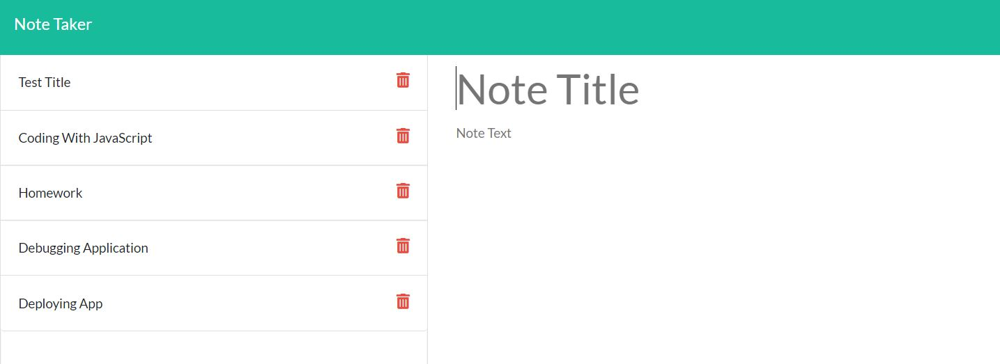
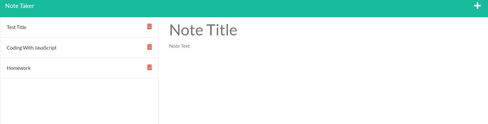

# note-taker-app
The Note Taker application allows the user to write and saves notes.

## I added some of the following items:  
 

- Created card html elements
- Wrote employee's classes
- Wrote inquirer function
- Wrote helper functions

## Sreenshots of the web page ##

The application lets user write and save important notes. The user can delete the notes no longer needed. 
The application was build with express and can be run with the npm start command from where the server.js is located.The above screenshots show a list of notes, the content inside of the notes and after the notes were deleted.

## Links ##

- GitHub Repository
(https://github.com/noviceprogrammeroh/note-taker-app)

## Video ##

